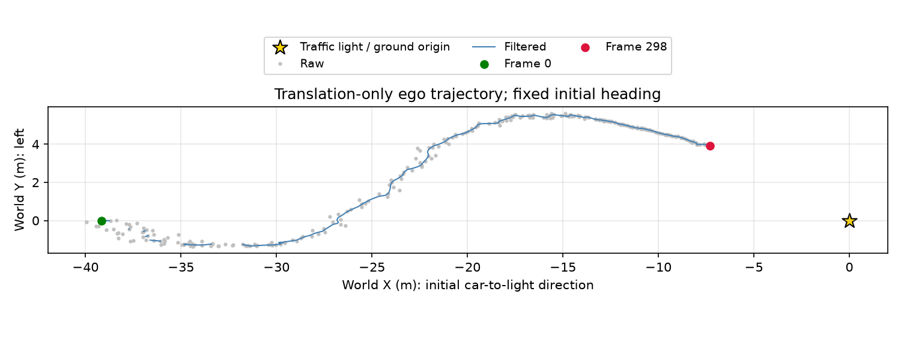

# Wisconsin Autonomous — Part A



[Watch or download the trajectory video](trajectory.mp4)

**Data.** All three ZIPs pass CRC checks: 299 RGB images, 299 unique XYZ arrays,
and 299 CSV rows, IDs 0–298; no missing or duplicate IDs. Archives are read in
place. Actual names are `rgb/leftNNNNNN.png`, `xyz/depthNNNNNN.npz`, and
`bbox_light.csv` (columns `frame,x1,y1,x2,y2`), unlike the challenge examples.
XYZ is float32 `(1200,1920,4)` under key `xyz`. Use both matching
`xyz-20260921T212945Z-1-001.zip` and `xyz-20260921T212945Z-1-002.zip`.

**Channel verification.** Across all 299 arrays, perspective ratios satisfy
Y/X ≈ −0.000783813u + 0.733322 and Z/X ≈ −0.000783813v + 0.473695;
frame-0 median residuals are below 1e−8. This identifies channels 0–2 as
forward, **left**, up: positive Y points toward image-left, contrary to the
challenge's “Y right” text. Metric scale follows the supplied meters definition.
Channel 3 is zero at every finite XYZ point and nonfinite elsewhere in every
array. It appears to be unused padding, not color/confidence; its producer
semantics cannot be proven from these files.

**Method.** Linearly interpolate each box coordinate for frames 3–5 between 2
and 6, and frame 23 between 22 and 24, without editing the CSV. Sample an 11×11
center patch clipped to the box. Reject nonfinite, zero/behind-camera, and
implausible points (X > 0.5 m, range < 60 m, |Y| < 40 m, |Z| < 15 m).
Reject depth deviations beyond max(0.30 m, 3×1.4826×MAD); take the coordinate
median of at least five remaining points. Remove positions >1 m from a
seven-frame local median, then apply a five-frame median and three-frame
weighted mean [1,2,1] within valid stretches. Preserve gaps and frame-0/end
measurements. Raw positions and every rejection remain visible in CSV/plot.

**World frame and assumptions.** Origin is under the light; +Z up. Let
θ=atan2(Y₀,X₀) from actual frame 0. Ego XY = −R(−θ)[X,Y], aligning the
initial car-to-light ray with world +X and world +Y left. Assume fixed camera
orientation (yaw, pitch, roll) and mounting; one landmark cannot recover both
translation and changing orientation. Thus lateral curvature may include
turning effects, not true lateral travel. Camera height is irrelevant to XY.
Time uses assumed 30 fps (no timestamps), t=frame_id/30, with t=0 at frame 0.

**Results.** 275/299 filtered positions; no failed depth patches,
24 rejected outliers. X: -39.17 to -7.27 m;
Y: -1.33 to 5.55 m. Median/max adjacent valid step:
0.093/0.464 m (raw max
2.725 m). Early long-range stereo jitter remains;
this is not an independently validated odometry estimate. PNGs open and all
299 MP4 frames decode, including unavailable-position slots (9.97 s).

**Reproduce (PowerShell, project root):**
```powershell
python -m venv .venv
.\.venv\Scripts\python.exe -m pip install -r requirements.txt
.\.venv\Scripts\python.exe main.py
```
Outputs: `trajectory.png`, `trajectory.mp4`, and `diagnostics/` (raw/filtered
CSV, box/patch overlays and crops, validation JSON). Dataset, ZIPs, environment
and caches are gitignored; outputs are retained.
